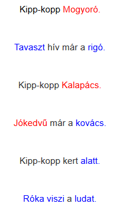

# Az -lj-vel, -llj-vel írt szavak

## Órai munka

Kezdd az órát az abc elmondásával!

Mozgásos mondóka:

Kipp-kopp Mogyoró.
Tavaszt hív már a rigó.
Kipp-kopp Kalapács.
Jókedvű már a kovács.
Kipp-kopp kert alatt.
Róka viszi a ludat.

Fekete: koppantás
Piros: dobbantás
Kék: tapsolás

Nyelvtan tankönyv 74-75. oldal. Szorgalmi a 76. oldal.
Minden feladatot figyelmesen olvass el! Ha valamit nem értesz, kérj segítséget!

## Házi feladat

Munkafüzet 60. oldal 1,2 feladat. Szabály lemásolása a szabályfüzetbe a tankönyv 75. oldaláról!

## Játékos feladat

https://tudasbazis.sulinet.hu/hu/magyar-nyelv-es-irodalom/magyar-nyelv/nyelvtan-2-osztaly/lj-vel-irjuk/az-lj-vel-irott-szavak-gyakorlas
