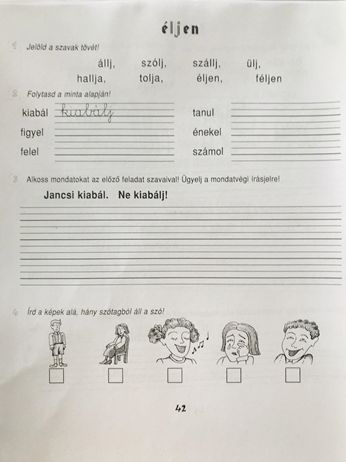

Kedves Gyerekek!

A mai írásóra anyagát a nyelvtan füzetbe fogjuk írni. Vedd elő a füzetedet!

* hagyj ki egy sort az előző munkád után,
* írd fel a dátumot, (III.20.)
* másold le az 1. feladat szavait a füzetedbe,
* jelöld álló egyenessel a szavak tövét,
* hagyj ki megint egy sort,
* írd le a 2. feladat szópárjait, sorban egymás mellé, ahogy én írtam (kiabál kiabálj, figyel figyelj stb.)
* megint hagyj ki egy sort,
* válassz ki három szót és írj velük mondatokat, ahogy a 3. feladatban látod!  Így összesen 6 mondatod lesz.

Már csak a 11 szó van hátra.

