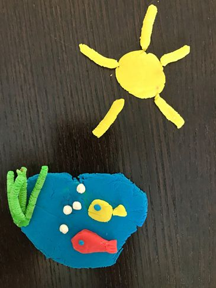

Kedves Gyerekek!

Március 22-én ünnepeljük a víz világnapját.
Milliók élnek a világban úgy, hogy nincs számukra elegendő és megfelelő vízmennyiség. A tiszta ivóvíz mellett gondolnunk kell a mindennapi életvitelhez szükséges vízre.
A víz a  legértékesebb erőforrásunk.

Albert mondja: A víz a végtelen körforgás
https://www.youtube.com/watch?v=6PCTQcmal10

Készítsetek gyurmából ti is hasonlót! Nagyon kíváncsi vagyok, miket találtok ki. :-)

Jó pihenést mindenkinek! Játsszatok, pihenjetek, mozogjatok sokat!
Pacsi, ölelés, pukedli, tánc
Andi néni

