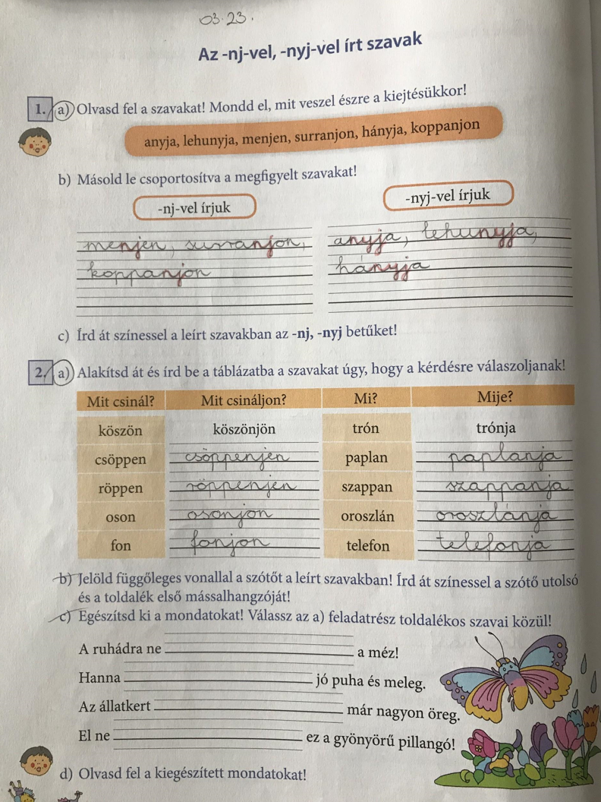

# Az -nj-vel, -nyj-vel írt szavak

## Órai munka

Nyisd ki a könyvedet a 77. oldalon!

* 1\. feladat: olvasd fel helyes kiejtéssel a szólásokat! Szüleid segítségével beszéljétek meg ezek jelentését! Ejtsd ki a szólásokban kiemelt szavakat! Figyeld meg, hogyan ejted ki a szavakat! (anyja-annya, unja-unnya, kívánja-kívánnya…)
Másold le csoportosítva a kiemelt szavakat! (nj, nyj)
* 2\. feladat: olvasd fel a szóoszlopokat helyes kiejtéssel! Mit vettél észre? Szótő!
c, részét ne csináld meg!
* Pótold a hiányzó mássalhangzókat! (A helyesírásban segítenek a 2.feladat szavai.)

## Házi feladat:

Szabály lemásolása a tk. 78. oldaláról a szabályfüzetbe, munkafüzet 62. oldal 1, 2/a
11 szó!

## Gyakorlás:

https://tudasbazis.sulinet.hu/hu/magyar-nyelv-es-irodalom/magyar-nyelv/nyelvtan-2-osztaly/nj-vel-nyj-vel-irjuk/az-nj-nyj-vel-irott-szavak-helyesirasa-a-gyakorlatban

