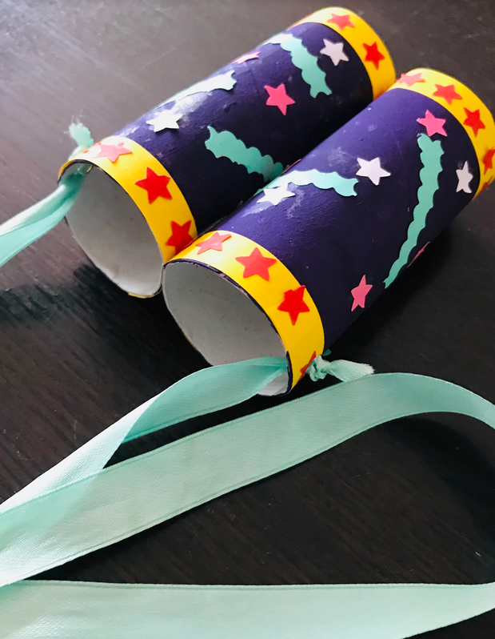

Sziasztok!

Ma egy távcsövet készíthettek el.

Szükséges anyagok, eszközök:

* 2 db wc papír guriga
* színes lapok (sima fehér papír, színes ceruza)
* tempera (vízfesték, színes ceruza)
* olló
* ragasztó
* színes szalag (spárga)

Menete:

* fesd le, vagy színezd ki a gurigákat,
* színes papírból vágj különböző mintákat,
* ragaszd össze a két gurigát,
* fűzz bele szalagot, vagy spárgát!

Jó munkát! :-)

Andi néni

