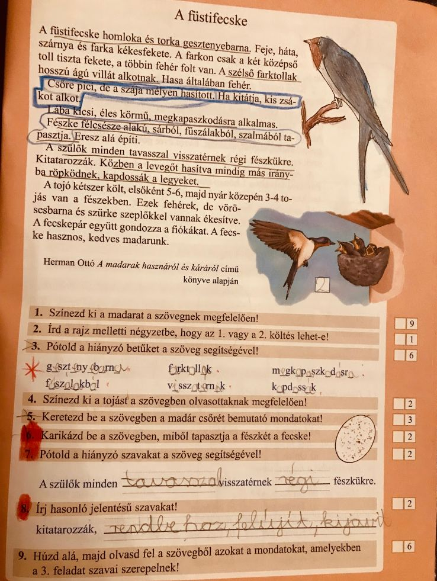

# A füstifecske

## Órai munka:

Nyisd ki a szövegértés munkafüzetedet a 39. oldalon!

Mielőtt nekikezdesz az olvasásnak, számold meg, hogy hány bekezdésből áll a szöveg! 
Olvasd el a szöveget! 
A szöveg elolvasása után foglald össze, hogy miről szóltak az egyes bekezdések! 
A feladatok elvégzése előtt olvasd el újra a szöveget! 
Az utasításoknak megfelelően dolgozz! (aláhúzás, bekeretezés, karikázás)

## Érdekesség:

https://www.youtube.com/watch?v=iuiwa4AeyyI

Önellenőrzéssel javíts!

