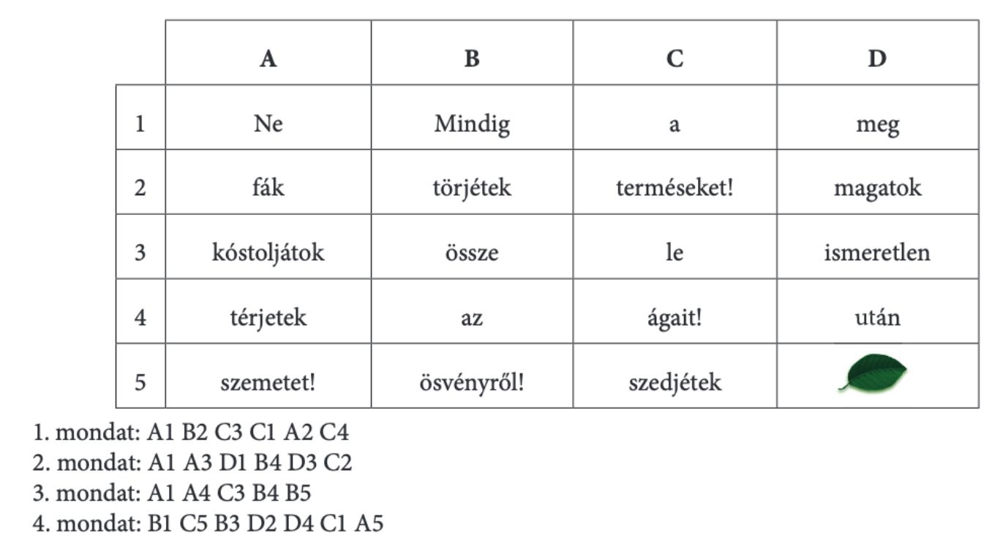
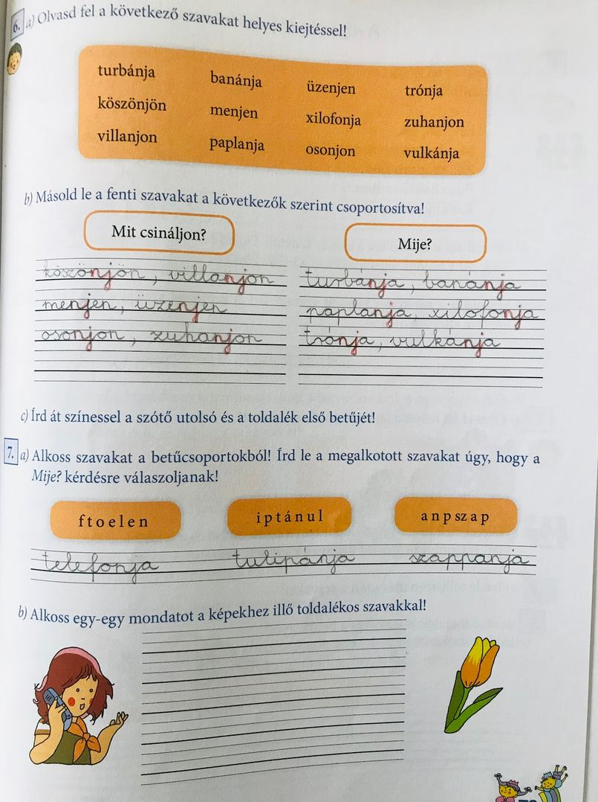

# Az -nj-vel, -nyj-vel írt szavak

## Órai munka:

Nyisd ki a tankönyvedet a 79. oldalon!

6. feladat:

  * a, olvasd el többször a szavakat! Figyelj a helyes kiejtésre! Milyen hangot mondasz? (nny) Pl.: turbánja-turbánnya…
  * b, másold le a szavakat csoportosítva! Kérdezz rá! Segítenek a kérdő mondatok.
  * c, írd át színessel a szótő utolsó és a toldalék első betűjét (turbánja)

7. feladat:

  * a, összekeveredtek a betűk,
  * először alkoss értelmes szavakat belőlük, majd kérdezz rá a szavakra! Mije?
  * b, két szóval (telefon, tulipán) alkoss mondatot! Itt is segít a mije? kérdőszó.

_Megoldókulccsal ellenőrizd a munkádat! Tegyél csillagot a könyvedbe, ha helyesek a megoldásaid!_

A következő feladathoz vedd elő a nyelvtan füzetedet!

4 mondatot kell leírnod a füzetbe. Neked kell megkeresned a szavakat a mondatokhoz.
Első mondat: keresd meg az A oszlopot, hozzá az első szót! Ezzel a szóval kezdődik a mondatod. Következő szó: B oszlop második szó, majd C oszlop harmadik szó, aztán újra az A oszlop második szava, majd a C oszlop negyedik. Így tovább!

+11 szó!

Játékos feladat:

https://learningapps.org/4726860

1. Ne törjétek le a fák ágait!
2. Ne kóstoljátok meg az ismeretlen terméseket!
3. Ne térjetek le az ösvényről!
4. Mindig szedjétek össze magatok után a szemetet!
