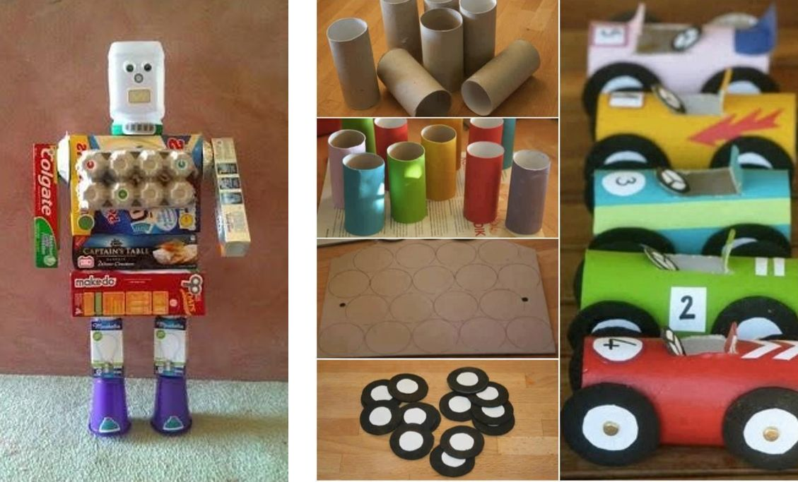

Kedves Gyerekek!

Az e heti kézműves feladat, a következő lesz:

Készítsd el _Robo-barátodat_ vagy _kisautódat_!
Készíts egy cuki robotot (autót) az otthon fellelhető anyagokból. Így a munkád nem csak cuki lesz és barátságos, hanem környezetvédő is! ;-)

Inspirációnak:

Szükséges eszközök, anyagok: Papírdobozok, műanyag dobozok, tojástartó...bármi, amiben
fantáziát látsz, és amire Anyának nincs szüksége, és úgyis kidobnátok. Előtte kérdezd
meg!!!

* ragasztó
* olló
* -filctoll

1. Találd ki miből legyen a robobarátod! Készítsd el a testét!
2. Rajzolj neki szemet, orrot, szájat!
3. Nevezd el, és írd rá a testére a nevét!
4. Játsz vele! :)

HA ELKÉSZÜLTÉL, KÜLDJ FOTÓT A KISKEDVENCEDRŐL! Alig várom, hogy lássam
őket! :)

Jó munkát, jó szórakozást kívánok!

Viki néni

2020.március 27.
