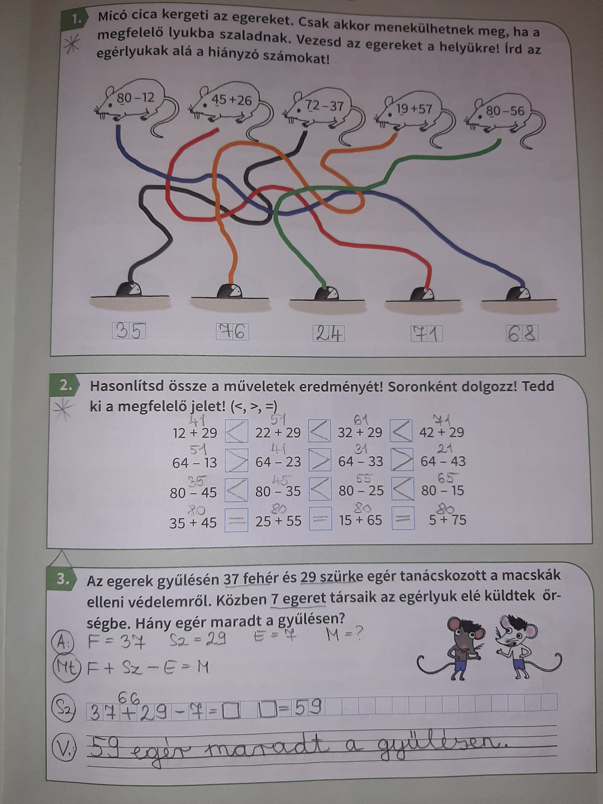
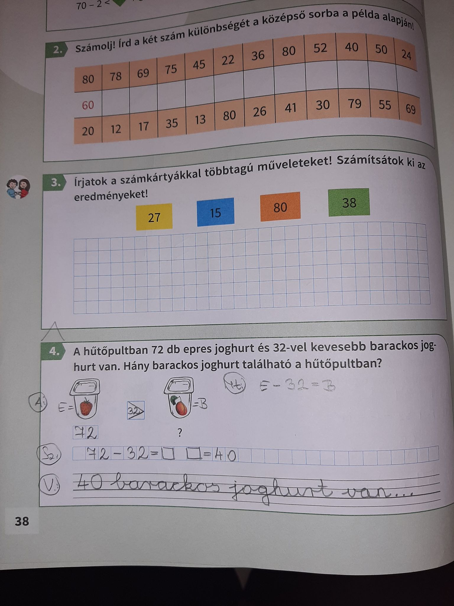

# Röpdolgozat

1. Regisztrálni a Redmenta oldalon. (A gyerek neve, email cím, ami nem kell, hogy a gyereké legyen.)
2. A felső sor közepén, a direktcímre kattintva, a következőt írjátok be: szorzó röpi
3. Elvileg már látni is fogjátok a feladatlapot, amit a GYEREKEK 9-13 óra között végezhetnek el.
4. Rákattintotok és el is lehet kezdeni... csak egyszer tölthetitek ki és összesen 10 perc áll a rendelkezésetekre. (10 db szorzás és 10 db osztás lesz a feladat, amit az eredménnyel párosítani kell, kb.:2 perc alatt végezhető el)
5. Ha alul a továbbítás gombra nyomtok, először meglátjátok, hogy minden feladatot kitöltöttetek-e, ha még egyszer tovább, akkor már elkülditek a feladatot, aminek ti is és én is rögtön látni fogom az eredményét.

# március 30.

Tk.: 56/1. 56/2. 56/3. 
Szorgalmi: Tk.: 57/2. 57/4.

56/1. Figyeljenek a kivonásnál a sorrendre, először mindig a kerek tízeseket vesszük el és csak utána az egyeseket.

56/2. Érdemes soronként dolgozni, hogy ugyan azokat a számokat kelljen kivonni.

56/3. Próbálják meg önállóan értelmezni, ha nem megy akkor mondjátok el, hogy ez tulajdonképpen, csak pótlás 80-ra.

*57/2. Mindenképp írják a számolás fölé az eredményeket és csak utána írják közé a relációs jeleket.

*57/4. Az a) nem fog gondot okozni, a b)-nél a középső egértől jobbra kell elindulni, utána pedig visszafelé. Vigyázzanak arra, hogy visszafelé ellentét művelettel számoljanak!

