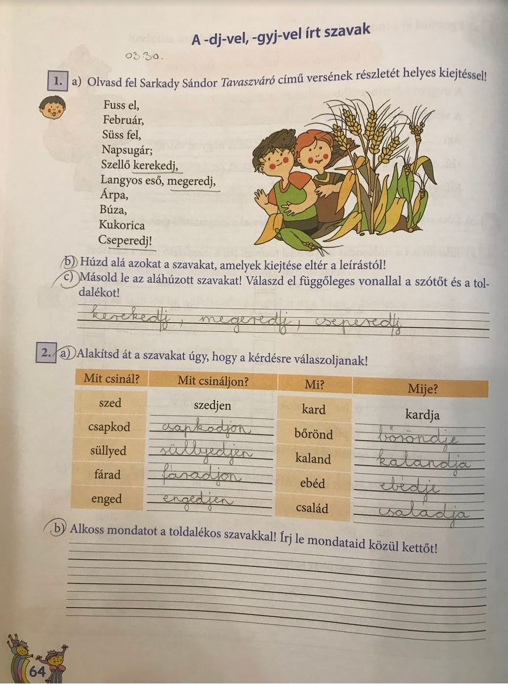
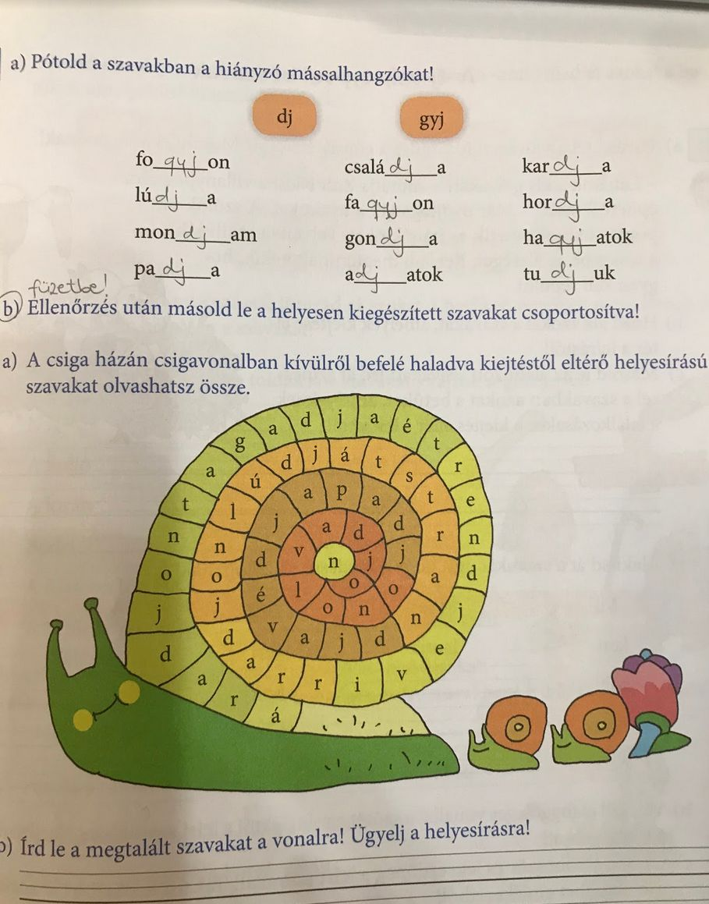
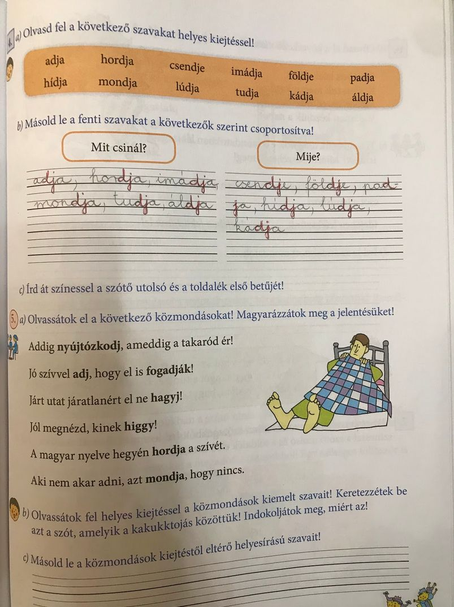

# A -dj-vel, -gyj-vel írt szavak

## Órai munka:

Nyisd ki a nyelvtan könyvet a 82. oldalon, és olvasd el a szabályt!

Lapozz vissza a 81. oldalra, és olvasd fel hangosan a 4. feladat szavait! Figyelj a helyes kiejtésre.

Pl.: adja-aggya, hordja-horgya stb.

A feladat b. részében csoportosítsd a szavakat! Ellenőrizd a megoldásodat!

Nyisd ki a munkafüzetet a 64. oldalon!

1, feladat: Húzd alá a versben azokat a szavakat, amelyek kiejtése eltér a leírástól, másold le az aláhúzott szavakat!

2, Alakítsd át úgy a szavakat, hogy a kérdésre válaszoljanak!

A feladat b. részében, válassz ki 3 szót és alkoss vele mondatot!

## Házi feladat:

Munkafüzet 65. oldal 3. feladat. Füzetbe másold le a szavakat!

Szabály másolása (Tk. 82. oldal) a szabályfüzetbe.

11 szó!

## Gyakorló feladat:

https://tudasbazis.sulinet.hu/hu/magyar-nyelv-es-irodalom/magyar-nyelv/nyelvtan-2-osztaly/dj-vel-gyj-vel-irjuk/a-dj-gyj-vel-irott-szavak-helyesirasa-a-gyakorlatban

