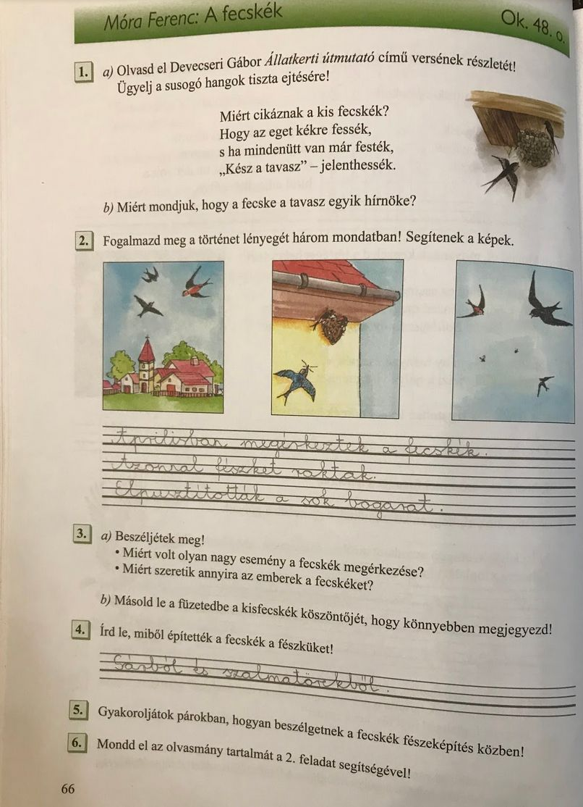

# A fecskék

## Órai munka:

Nyisd ki az olvasókönyvet a 48. oldalon, és olvasd el a történetet!

Keresd meg az ismeretlen szavakat!

Próbáld elmesélni a történet lényegét 3-4 mondatban!

Segítő kérdések:

* Mikor érkeztek meg a fecskék?
* Mit csináltak miután megérkeztek?
* Mi történt a kertben?

## Házi feladat:

Munkafüzet 66. oldal 2,4 feladat.

## Gyakorló feladat:

https://tudasbazis.sulinet.hu/hu/magyar-nyelv-es-irodalom/magyar-nyelv/nyelvtan-irodalom-1-osztaly/fecskek-olvasas-szovegertes/fecskek-feladatok-1

