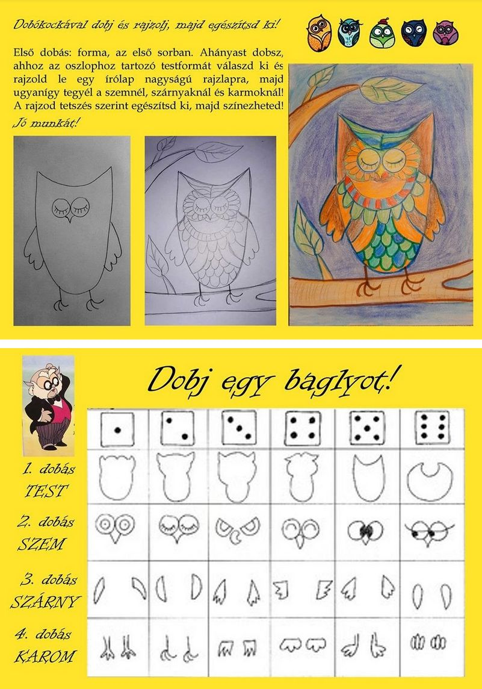

Dobj egy baglyot!

Szükséges eszközök:

* dobókocka
* rajzlap
* grafitceruza
* színes ceruza, zsírkréta, filc (te választod ki, mivel szeretnéd kiszínezni)

Várom az ötletes alkotásokat!

Andi néni

