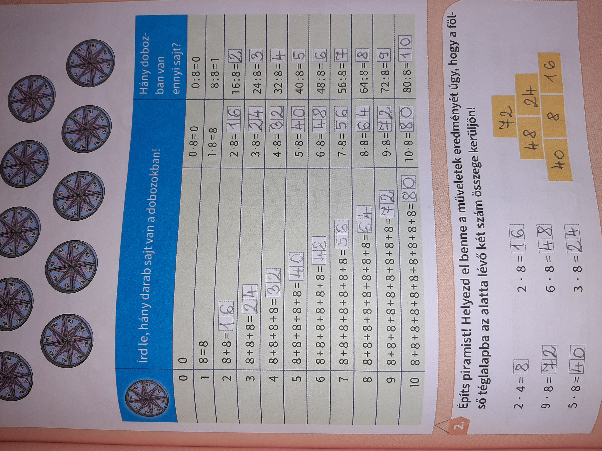
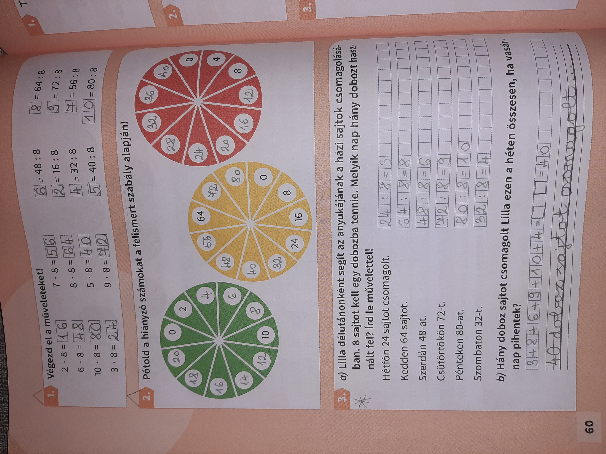

Kedves Szülők!

Áttérünk a 8-as szorzó-bennfoglaló táblára...

Tk. 59/1. 59/2. 60/1. 60/2. 
Szorgalmi: 60/3. + Az eddig kihagyott feladatok közül bármi...

59/2. A piramist a tetejéről kezdjék megoldani, úgy sokkal könnyebb lesz. 
59/2. Három számsorról van szó, amit már tanultunk...

A vakondost és a 7-es 8-as szorzós feladatokat érdemes gyakorolni, az eddig megosztott játékok közül. A jövő héten, megint írunk szorzó-bennfoglaló dolgozatot, már a 8-assal kiegészítve.

Hogy ne felejtsük el az összeadást-kivonást sem, redmentán lesz egy feladat, amit szombatig kell kitölteni.

Direktcím: fejszámolás70

Jó munkát!
Viki

