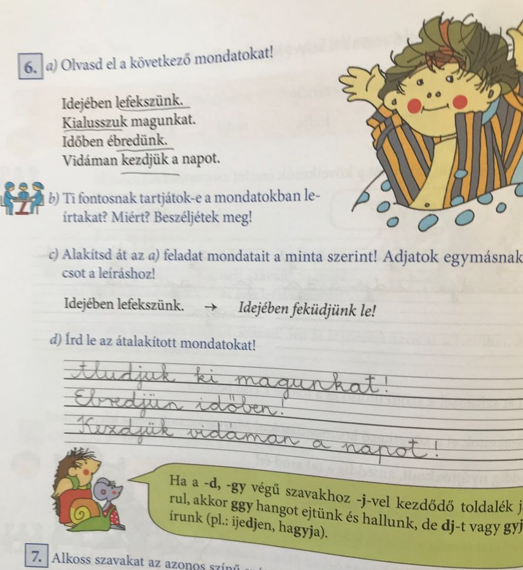
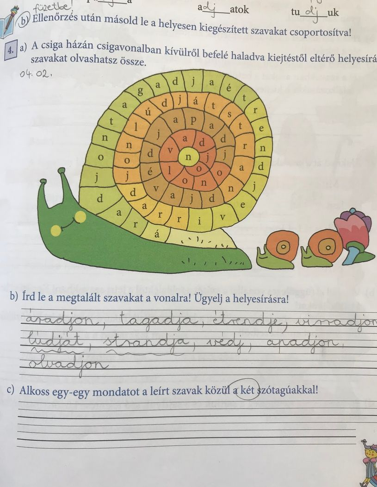

# A -dj-vel, gyj-vel írt szavak helyesírása

## Órai munka:

Nyisd ki a könyvedet a 82. oldalon. Ismételd át a szabályt!

Ezután oldd meg a 6. feladatot. Húzd alá a következő szavakat a mondatokban.
(lefekszünk, kialusszuk, ébredünk, kezdjük)

Nézd meg a feladat c, részében, hogyan alakították át a mondatot!
Idejében lefekszünk. ------- Idejében feküdjünk le! Tanácsot adnak nekünk.

Próbáld meg a többi aláhúzott szóval is hasonlóan.
Ellenőrizd a megoldásod!

Nyisd ki a munkafüzetet a 65. oldalon és oldd meg a 4. feladatot! A feladat c, részében alkotnod kell a leírt szavak közül a két szótagúakkal egy-egy mondatot.

Ellenőrizd a megoldásod!

+11 szó!

## Gyakorló feladat:

https://learningapps.org/2313410

https://wordwall.net/resource/990735/nyelvtan/kiejtéstől-eltérő-helyes%C3%ADrású-szavak-dj-gyj

