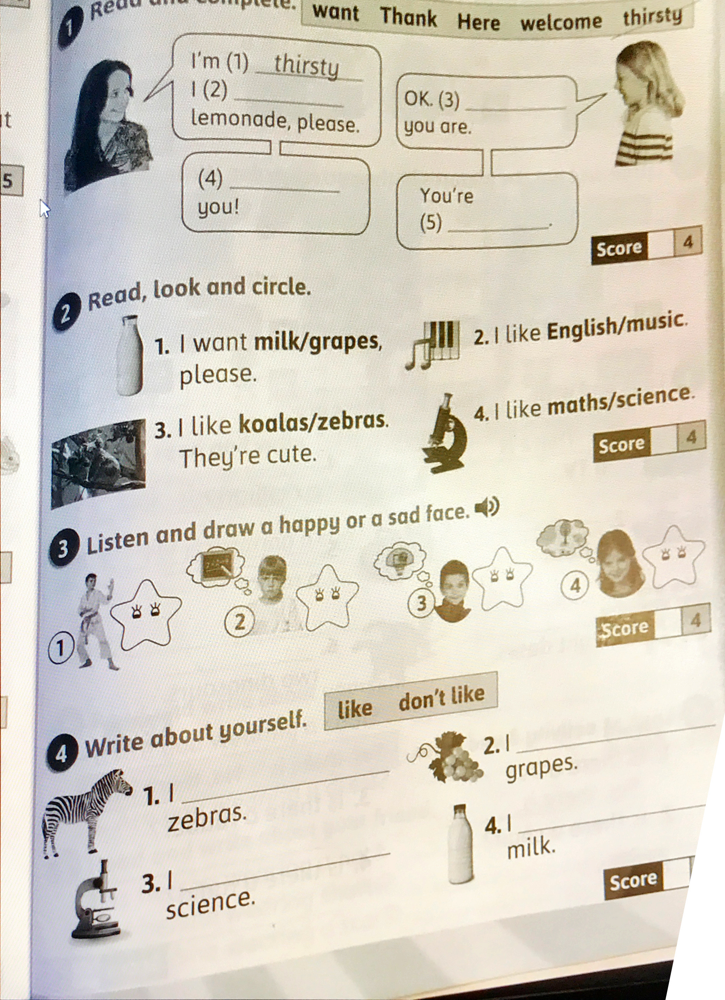

1\. feladat: Olvasd el a párbeszédet, és egészítsd ki a felső sor valamelyik szavával (vastag betűs rész)!

2\. feladat: Karikázd be (ha külön lapon dolgozol, írd le a helyes szót) a kettő vastagbetűs szó közül a megfelelőt!

3\. feladat: ITT A SZÜLŐKNEK KELLENE FELOLVASNIUK a 4 képhez tartozó párbeszédet. Aszerint döntsék el, és aztán egészítsék ki az arcot vidám vagy szomorú szájjal!

```
Girl: Do you like karate?
Boy: No, I don't.

Boy: Do you like maths?
Girl: No, I don't.

Girl: Do you like PE?
Boy: Yes, I do.

Boy: Do you like stickers?
Girl: Yes, I do.
```

4\. feladat: Magaddal kapcsolatban alkoss mondatokat a képek alapján! Szereted vagy nem szereted a képeken látható dolgokat?


