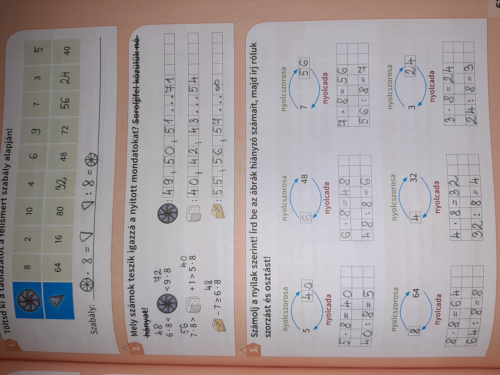
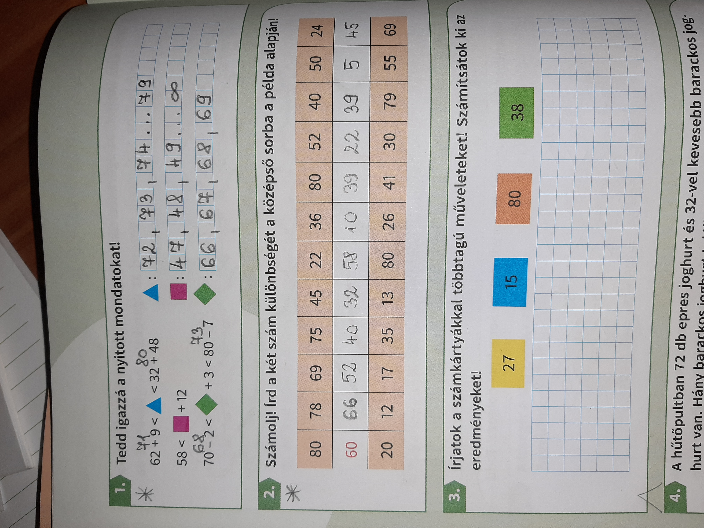

Kedves Szülők!

A holnapi feladatok...

Tk. 61/1. 61/2. 61/3. 
Szorgalmi: Mf. 38/1. 38/2.

Tk.: 61/1. Tulajdonképp itt az a kérdés, hogy ha 1 dobozba 8 sajt fér, akkor hány dobozra van szükség? Fordítva pedig ha a dobozok számát tudjuk, hány sajt fér bele annyi dobozba?
A szabályleírást a megoldóban találjátok.

61/2. Itt szokásunkhoz híven, az összes lehetséges megoldást kérem!!! Először mindig olvassák le a nyitott mondatot, aztán tegyék egyenlővé és innen már könnyű lesz...

61/3. Itt arra figyeljenek, hogy nem lehet felcserélni a szorzás sorrendjét a feladat alapján, csak egy féle megoldás jó.

*Mf.: 38/1. Ugyan azok vonatkoznak, mint az előző nyitott mondatos feladatokra.

*38/2. Mindig a nagyobból kivonják a kisebbet és az eredmény kerül középre.

Online még mindig a 7-es 8-as szorzó gyakorlását kérem.

Jó munkát!

Viki

Kedves Szülők! Egy kis + szorgalmi feladat: Vétettem egy apró hibát a megoldó kulcsban, amelyik GYEREK megtalálja és visszaküldi nekem dicséretben és szorgalmi pontban részesül!😅

