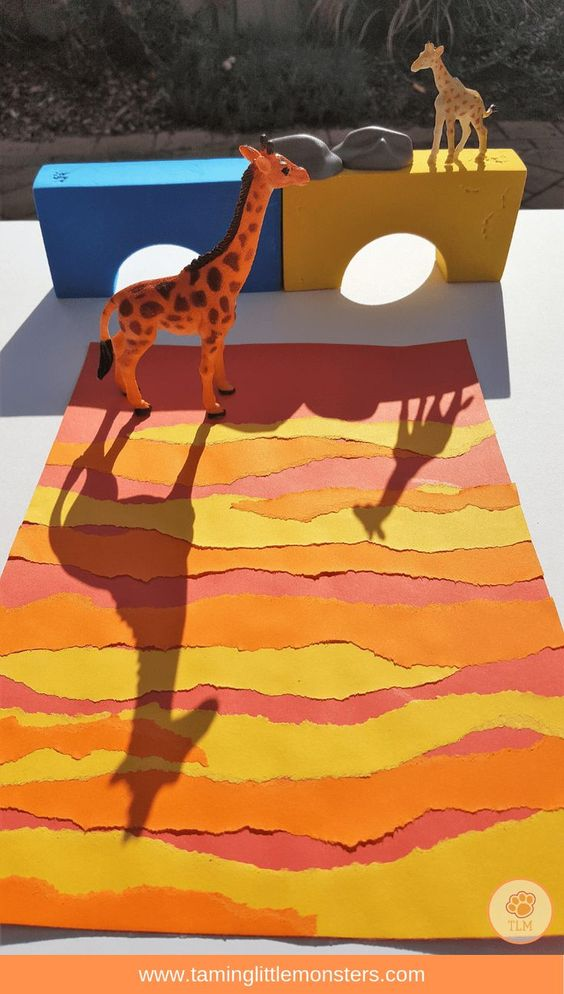
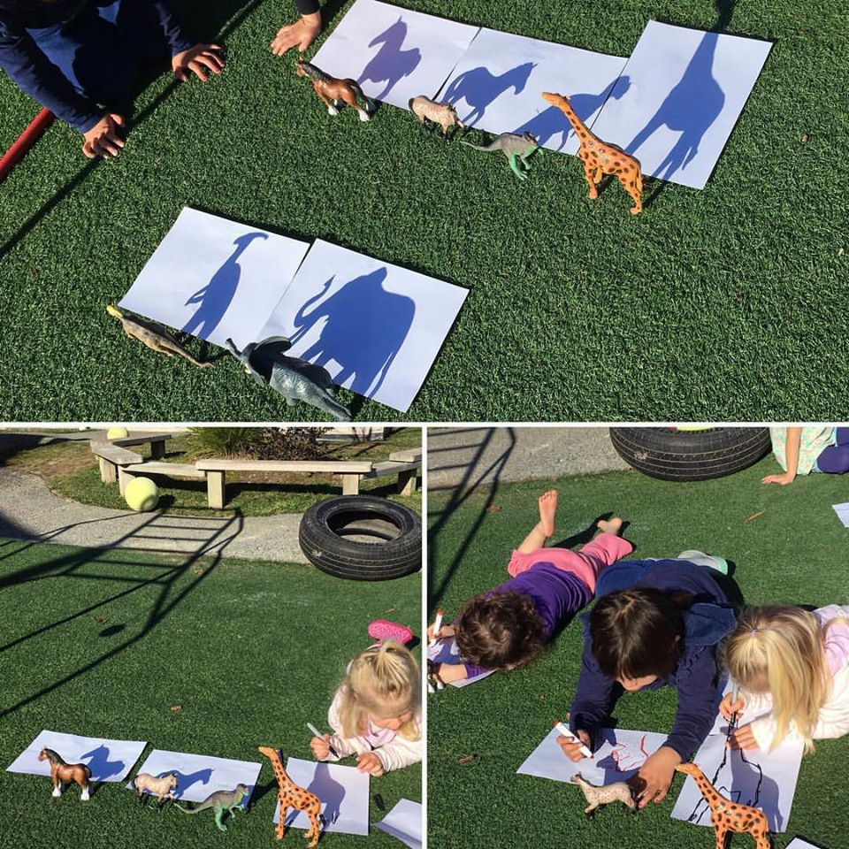
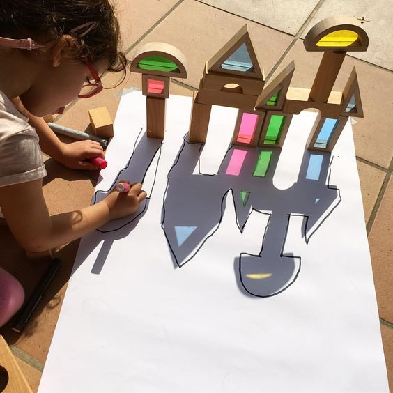
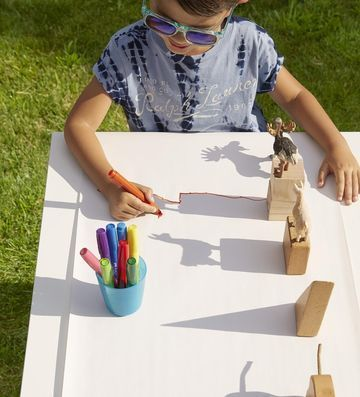

Kedves Gyerekek!

A mai rajz feladat nagyon mókás lesz, remélem Nektek is tetszeni fog! :)

Téma: fény-árnyék, játék a fénnyel

Eszközök: fehér papír, grafit ceruza, színes ceruza vagy festék, játékok

Feladat: Kép, festmény készítése fény segítségével

Feladatok a mai napra:

1. Nézd meg a következő képeket! Használd őket inspirációnak!
2. Találd ki, hogy melyik játékoddal szeretnéd ezt az árnyékos játékot megvalósítani!
3. Ha süt a nap, próbálj az ablak közelében dolgozni! Ha nem süt a nap, akkor egy lámpa
segítségével is el tudod készíteni a művedet.
4. Tedd le a lapot az asztalra, a lapra az általad választott játékot és világítsd meg úgy a
tárgyat, hogy az árnyéka a lapra vetüljön!
5. Rajzold körbe az árnyékot!

Ha már belejöttél, akkor most készíts egy szép színes képet az ismert technikával.

1. Fess hátteret a képnek! Vagy színes papírból is ragaszthatsz!
2. Találd ki mi legyen a képeden!
3. Rakd fel a játékokat a megszáradt papírra, világítsd meg!
4. Rajzold körbe!
5. Fesd ki a körberajzolt árnyékot!
6. Küldd el nekem a képet lefotózva!

Jó alkotást!
Viki néni
