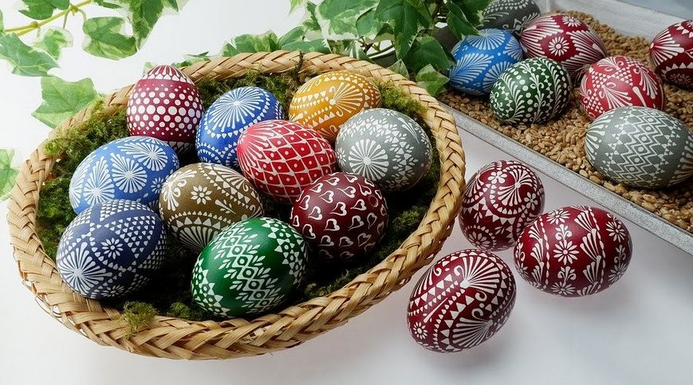

# Húsvét      

        

## Órai munka:

Közeledik a tavaszi szünet és vele a húsvét.

Nyisd ki a könyvedet a 134. oldalon! Olvasd el a szöveget!

Húzd alá a kérdésekre a választ!

* Mit ünnepel ilyenkor a kereszténység?
* Milyen népszokások kapcsolódnak a húsvéti ünnepkörhöz?
* Mivel locsolták meg régen a lányokat?
* A lányok mit adtak ajándékba?

## Házi feladat:

Nézz utána, milyen húsvéti jelképeink vannak. (állatok, növény, ételek)
Válassz ki egyet, és az olvasásfüzetbe írj erről néhány mondatot.
Ne feledd a címet (Húsvét), dátumot (III.6.)

Várom az érdekes beszámolókat! :-)

## Játékos feladat:

https://wordwall.net/resource/1186508/húsvét
