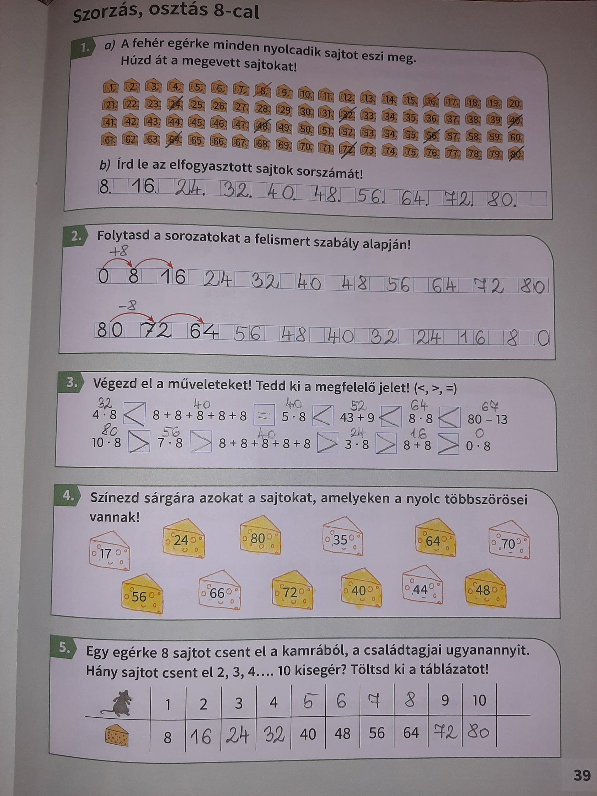
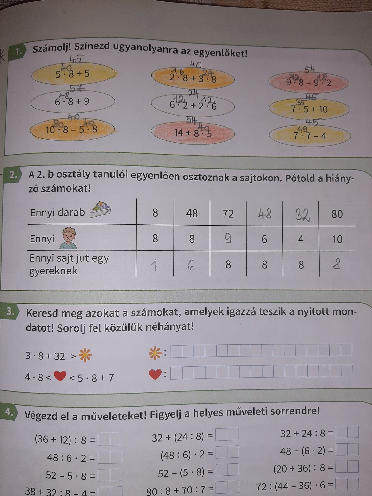

Kedves Szülők!

Csak a 8-as szorzótáblát gyakoroljuk a mai napon.

Mf.:39/1,2,3,4,5 
Szorgalmi: Mf.:41/1,2

A feladatok nagyon egyszerűek, nem igényelnek különösebb magyarázatot. A 3-as feladatnál, arra figyeljenek hogy a részeredményeket is ki kell írni. Mindent önellenőrzéssel javítsanak a megoldó kulcs alapján!

*41/1. Írják ki a részeredményeket, ügyeljenek a műveleti sorrendre.

Ha készen vannak a munkafüzetben a feladatok, akkor lehet a redmentás gyakorlót megcsinálni. Csak 8-as szorzó-bennfoglaló lesz benne.

8-17 között tölthetitek ki (6 perc alatt), 3 lehetősége lesz mindenkinek, hogy 100%-ot teljesítsen.😃
Direktcím: `arpad2`

Viki

