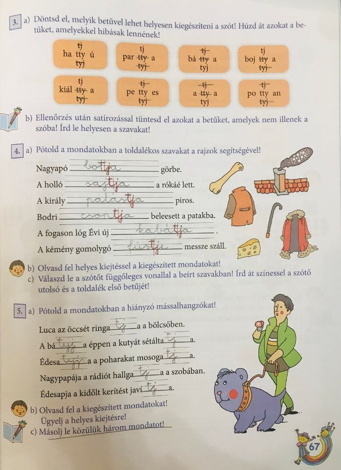

# A tj-vel, -tyj-vel írt szavak helyesírása

## Órai munka:

Elevenítsd fel, amit ezeknek a szavaknak a helyesírásáról tanultunk!
Nyisd ki a könyved a 82. oldalon és olvasd el a szabályt!

Olvasd el a következő szavakat! Figyelj a helyes kiejtésre!

látjuk, szállítják, gyógyítja, atyja, mutatják, bátyja, partja, kertje

Nyisd ki a munkafüzetet a 67. oldalon!

3\. feladat: Azokat a betűket kell áthúzni, amelyek behelyettesítésével hibás lenne szó!
Ellenőrizd a megoldásod! Másold le helyesen a szavakat a füzetbe!

4\. feladat: A képek segítségével kell pótolnod a mondatokban a hiányzó szavakat!

5\. feladat: Pótold a hiányzó mássalhangzókat! Segít, ha megkeresed a szótőt!
Válassz ki 3 mondatot, és másold le füzetedbe!

## Házi feladat:

https://wordwall.net/hu/resource/1024916/nyelvtan/tj-tyj

https://wordwall.net/hu/resource/909826/nyelvtan/tj-vel-tyj-vel-%C3%ADrt-szavak-1

https://learningapps.org/4935498

11 szó!

