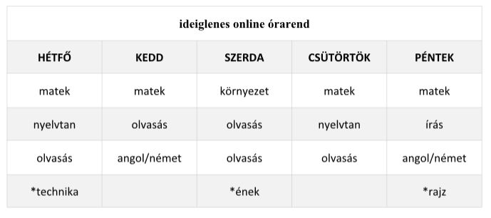

# Biatorbágyi Általános Iskola 2. b. osztály házi feladatok

Ez az oldal tartalmazza a koronavírus járvány miatt kialakult helyzetben
online kiosztott házi feladatokat a Biatorbágyi Általános Iskola 2. b. osztálya
számára.

Kedves Szülők!
Legyetek szívesek a befotózott munkákat ÁLLÓ FORMÁBAN küldeni, lényegesen megkönnyítené a munkámat... KÖSZÖNÖM!

Rendszerezve a dátum és a tantárgy neve alapján van.

* [2020-03-18 Angol](2020-03-18-angol.md)
* [2020-03-18 Matematika](2020-03-18-matematika.md)
* [2020-03-18 Környezet](2020-03-18-kornyezet.md)
* [2020-03-18 Nyelvtan](2020-03-18-nyelvtan.md)
* [2020-03-18 Olvasás](2020-03-18-olvasas.md)
* [2020-03-19 Matematika](2020-03-19-matematika.md)
* [2020-03-19 Nyelvtan](2020-03-19-nyelvtan.md)
* [2020-03-19 Olvasás](2020-03-19-olvasas.md)
* [2020-03-20 Angol](2020-03-20-angol.md)
* [2020-03-20 Írás](2020-03-20-iras.md)
* [2020-03-20 Matematika](2020-03-20-matematika.md)
* [2020-03-20 Rajz](2020-03-20-rajz.md)
* [2020-03-20 Technika](2020-03-20-technika.md)
* [2020-03-23 Matematika](2020-03-23-matematika.md)
* [2020-03-23 Nyelvtan](2020-03-23-nyelvtan.md)
* [2020-03-23 Olvasás](2020-03-23-olvasas.md)
* [2020-03-23 Szavak](2020-03-23-szavak.md)
* [2020-03-23 Technika](2020-03-23-technika.md)
* [2020-03-24 Angol](2020-03-24-angol.md)
* [2020-03-24 Matematika](2020-03-24-matematika.md)
* [2020-03-24 Olvasás](2020-03-24-olvasas.md)
* [2020-03-25 Környezet](2020-03-25-kornyezet.md)
* [2020-03-25 Olvasás](2020-03-25-olvasas.md)
* [2020-03-26 Nyelvtan](2020-03-26-nyelvtan.md)
* [2020-03-26 Olvasás](2020-03-26-olvasas.md)
* [2020-03-26 Matematika](2020-03-26-matematika.md)
* [2020-03-27 Matematika](2020-03-27-matematika.md)
* [2020-03-27 Rajz](2020-03-27-rajz.md)
* [2020-03-27 Írás](2020-03-27-iras.md)
* [2020-03-27 Tollbamondás](2020-03-27-tollbamondas.md)
* [2020-03-30 Szavak](2020-03-30-szavak.md)
* [2020-03-30 Matematika](2020-03-30-matematika.md)
* [2020-03-30 Nyelvtan](2020-03-30-nyelvtan.md)
* [2020-03-30 Olvasás](2020-03-30-olvasas.md)
* [2020-03-30 Technika](2020-03-30-technika.md)
* [2020-03-31 Olvasás](2020-03-31-olvasas.pdf)
* [2020-03-31 Matematika](2020-03-31-matematika.md)
* [2020-04-01 Környezet](2020-04-01-kornyezet.md)
* [2020-04-01 Olvasás](2020-04-01-olvasas.md)
* [Bolondok napja](2020-04-01-bolondok-napja.pdf)
* [2020-04-02 Matematika](2020-04-02-matematika.md)
* [2020-04-02 Nyelvtan](2020-04-02-nyelvtan.md)
* [2020-04-02 Olvasás](2020-04-02-olvasas.md)
* [2020-04-03 Angol](2020-04-03-angol.md)
* [2020-04-03 Írás](2020-04-03-iras.md)
* [2020-04-03 Matematika](2020-04-03-matematika.md)
* [2020-04-03 Rajz](2020-04-03-rajz.md)
* [2020-04-06 Matematika](2020-04-06-matematika.md)
* [2020-04-06 Nyelvtan](2020-04-06-nyelvtan.md)
* [2020-04-06 Szavak](2020-04-06-szavak.md)
* [2020-04-06 Olvasás](2020-04-06-olvasas.md)
* [2020-04-06 Technika](2020-04-06-technika.pdf)
* [2020-04-06 Húsvét](2020-04-06-husvet.pdf) Harmónika nyúl hajtogatás: https://www.youtube.com/watch?v=4jSEUTgCVfM
* 2020-04-07 Matematika: Röpdolgozat a Redmentán
* [2020-04-07 Olvasás](2020-04-07-olvasas.md)
* [2020-04-07 Angol](2020-04-07-angol.md)
* [2020-04-15 Olvasás](2020-04-15-olvasas.md)
* [2020-04-15 Szavak](2020-04-15-szavak.jpg)
* [2020-04-15 Környezet](2020-04-15-kornyezet.md)
* [2020-04-16 Matematika](2020-04-16-matematika.md)
* [2020-04-16 Olvasás](2020-04-16-olvasas.md)
* [2020-04-16 Nyelvtan](2020-04-16-nyelvtan.md)
* [2020-04-17 Matematika](2020-04-17-matematika.md)
* [2020-04-17 Írás](2020-04-17-iras.md)
* [2020-04-17 Angol](2020-04-17-angol.md)
* [2020-04-17 Rajz](2020-04-17-rajz.md)
* [2020-04-20 Matematika](2020-04-20-matematika.md)
* [2020-04-20 Nyelvtan](2020-04-20-nyelvtan.pdf)
* [2020-04-20 Tollbamondás](2020-04-20-tollbamondas.m4a)
* [2020-04-20 Szavak](2020-04-20-szavak.pdf)
* [2020-04-20 Olvasás](2020-04-20-olvasas.pdf)
* [2020-04-20 Technika](2020-04-20-technika.pdf)
* [2020-04-21 Matematika](2020-04-21-matematika.md)
* [2020-04-21 Olvasás](2020-04-21-olvasas.pdf)
* [2020-04-21 Angol](2020-04-21-angol.md)
* [2020-04-22 Olvasás](2020-04-22-olvasas.md)
* [2020-04-22 Környezet](2020-04-22-kornyezet.pptx)
* 2020-04-23 Matematika: témazáró dolgozat a 80-as számkörből Redmentán
* [2020-04-23 Nyelvtan](2020-04-23-nyelvtan.pdf)
* [2020-04-23 Olvasás](2020-04-23-olvasas.pdf)
* [2020-04-24 Matematika](2020-04-24-matematika.md)
* [2020-04-24 Nyelvtan](2020-04-24-nyelvtan.md)
* [2020-04-24 Rajz](2020-04-24-rajz.docx)

# Online letölthető tankönyvvek

https://www.tankonyvkatalogus.hu/

# Tesi

jóga: https://www.youtube.com/watch?v=37FQwSuymKw

https://www.youtube.com/watch?v=4ZqQmxf7WQs

tesi: https://www.youtube.com/watch?v=6yL8yYJJ7Kw

https://www.youtube.com/watch?v=qBF_ogxb3Gc

https://www.youtube.com/watch?v=C5rx8s6kFAE
